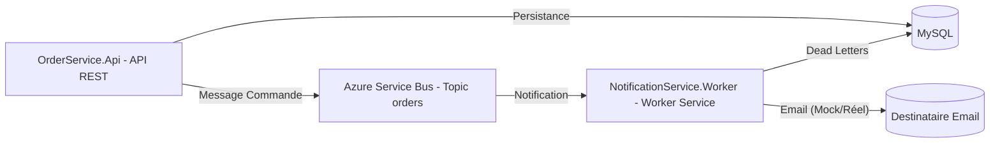

# Order Notification System

Système de notifications découplé via messaging en .NET utilisant Azure Service Bus **et MySQL pour la persistance**.

---

## 📦 Présentation

Ce projet propose une architecture microservices simple pour l’envoi de notifications lors de la création de commandes, **avec persistance des commandes et des messages Dead Letter en base de données MySQL**.

* **OrderService.Api** : API REST pour passer des commandes (stockées en MySQL)
* **NotificationService.Worker** : Service worker qui écoute les messages, traite les notifications, envoie des emails (mock ou réel) et archive en base MySQL les messages "dead letter"
* **Azure Service Bus** : Message broker cloud (topic/subscription)
* **MySQL** : Stockage des commandes et des dead letters

---

## 🏗️ Architecture



---

## 🚀 Fonctionnalités

* Découplage complet API/Notifications via messaging cloud
* Persistance des commandes **ET** des dead letters en base de données MySQL
* Traitement asynchrone des commandes
* Gestion automatique des erreurs avec stockage des messages "dead letter" en BDD pour audit/retraitement
* **Envoi de notifications par email** (mode mock par défaut, SMTP réel possible)
* Modèle extensible (ajout de nouveaux consommateurs facile)
* Prêt pour le déploiement cloud ou local (Docker, Azure App Service…)

---

## ⚙️ Installation & Lancement

### 1. Prérequis

* [.NET 8 SDK](https://dotnet.microsoft.com/download)
* Un compte Azure avec un Service Bus (niveau Standard)
* Un serveur MySQL local ou cloud
* Visual Studio 2022 ou VS Code
* [Docker Desktop](https://www.docker.com/products/docker-desktop/)

### 2. Cloner le repo

```bash
git clone https://github.com/votre-utilisateur/order-notification-system.git
cd order-notification-system
```

### 3. Configuration des secrets (User Secrets, pour le développement local)

Toutes les informations sensibles (**connection string Azure Service Bus & MySQL, configuration email**) sont gérées via [User Secrets .NET](https://learn.microsoft.com/fr-fr/aspnet/core/security/app-secrets?view=aspnetcore-8.0&tabs=windows) (aucune variable d’environnement n’est requise pour le développement local).

* **Connection string MySQL** :

  ```bash
  dotnet user-secrets set "ConnectionStrings:DefaultConnection" "server=localhost;port=3306;database=order_notification_db;user=root;password=motdepasse"
  ```
* **Connection string Azure Service Bus** :

  ```bash
  dotnet user-secrets set "ServiceBus:ConnectionString" "Endpoint=sb://...;SharedAccessKeyName=RootManageSharedAccessKey;SharedAccessKey=..."
  ```
* **Configuration email (optionnel, réel ou mock)** :

  ```bash
  # Pour tester le mock (par défaut, rien à configurer)

  # Pour brancher sur un vrai SMTP (ex : Mailtrap)
  dotnet user-secrets set "Email:Host" "sandbox.smtp.mailtrap.io"
  dotnet user-secrets set "Email:Port" "587"
  dotnet user-secrets set "Email:Username" "TON_USER"
  dotnet user-secrets set "Email:Password" "TON_PASS"
  ```

*Exécute ces commandes dans le dossier de chaque projet (`OrderService.Api` et `NotificationService.Worker`).*

### 4. Lancer les services en local

**Recommandé : démarrage multi-projets sous Visual Studio**

* Démarrer `NotificationService.Worker` (écouteur)
* Puis `OrderService.Api` (API REST)

### 5. Appliquer les migrations Entity Framework (local)

Si tu développes **hors Docker**, applique les migrations EF sur ta base locale MySQL :

```bash
cd OrderService.Api
# Ajoute les secrets si pas déjà fait
# dotnet user-secrets set "ConnectionStrings:DefaultConnection" ...
dotnet ef database update
```

---

## 🐳 Déploiement & fonctionnement avec Docker Compose

Le projet fournit un `docker-compose.yml` prêt à l’emploi.

### 1. Préparation

1. **Clone le repo** (voir plus haut)
2. **Copie le fichier `.env.example` en `.env`** et renseigne les variables :

   ```env
   MYSQL_CONNECTIONSTRING=Server=mysql;Port=3306;Database=order_notification_db;User=your_username;Password=your_password_
   AZURE_SERVICEBUS_CONNECTIONSTRING=Endpoint=sb://...;SharedAccessKeyName=RootManageSharedAccessKey;SharedAccessKey=...
   ```
3. (Optionnel) Ajoute la configuration SMTP si tu veux tester les vrais emails avec Docker (ou utilise le mock par défaut)

### 2. Lancer Docker Compose

```bash
docker compose up --build
```

Cela va :

* Builder les images
* Démarrer les conteneurs :

  * `mysql` (BDD)
  * `orderservice.api` (API REST)
  * `notificationservice.worker` (worker)

### 3. Migrations et initialisation de la base (Docker)

> **Astuce :** Si besoin, applique les migrations EF **dans le conteneur** :
>
> ```bash
> docker compose exec orderservice.api dotnet ef database update
> ```
>
> (Tu peux aussi automatiser ça dans l’entrypoint si tu veux.)

### 4. Accès

* API REST : [http://localhost:5000/swagger](http://localhost:5000/swagger)
* MySQL : `localhost:3307`

---

## 📬 Tester l’API et les emails

* Accède à Swagger : `http://localhost:5000/swagger`
* Endpoint POST `/api/orders` :

```json
{
  "customerName": "Alice Dupont",
  "amount": 123.45
}
```

* Sur envoi, vérifie la console du worker :

  * `[Notification] Nouvelle commande reçue ...`
  * `[MOCK EMAIL] Envoi réussi à test@demo.fr : {...}` ou erreur simulée
  * Si SMTP réel : email reçu dans la boîte mail cible
* Les commandes sont **persistées dans la base MySQL** (vérifie via Workbench ou CLI)
* En cas d’erreur ou de message non consommable, le worker archive automatiquement le message dead letter en base MySQL (table `DeadLetters`)

---

## 🛡️ Sécurité

* Les secrets sont transmis uniquement via User Secrets (local) ou variables d’environnement (Docker)
* Aucun secret versionné dans le repo
* Prêt pour CI/CD sécurisé

---

## 🗄️ Dead Letter (Gestion des erreurs)

* Si un message n'est pas consommé correctement par le worker (ex : erreur d’envoi d’email simulée ou réelle), il est automatiquement envoyé dans la **dead letter queue** d'Azure Service Bus.
* Le worker lit ces messages en dead letter et les enregistre en base de données MySQL (table `DeadLetters`).
* Cela permet l’audit, la supervision et le retraitement manuel ou automatisé des erreurs de messagerie.

---

## 🔗 Quelques pistes d'amélioration

* Notifications réelles (email, SMS, webhook…)
* Observabilité (logs, monitoring Azure)
* Déploiement cloud (Azure App Service, Docker Compose)
* **Dashboard/Front pour visualiser et rejouer les dead letters**
* Monitoring avancé et alertes

---

## 📝 Auteur

Florian – [portfolio-florian.fr](https://portfolio-florian.fr)
