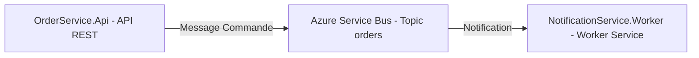

# Order Notification System

Système de notifications découplé via messaging en .NET utilisant Azure Service Bus.

---

## 📦 Présentation

Ce projet propose une architecture microservices simple pour l’envoi de notifications lors de la création de commandes.

* **OrderService.Api** : API REST pour passer des commandes
* **NotificationService.Worker** : Service worker qui écoute les messages et traite les notifications
* **Azure Service Bus** : Message broker cloud (topic/subscription)

---

## 🏗️ Architecture



---

## 🚀 Fonctionnalités

* Découplage complet API/Notifications via messaging cloud
* Traitement asynchrone des commandes
* Modèle extensible (ajout de nouveaux consommateurs facile)
* Prêt pour le déploiement cloud ou local (Docker, Azure App Service…)

---

## ⚙️ Installation & Lancement

### 1. Prérequis

* [.NET 8 SDK](https://dotnet.microsoft.com/download)
* Un compte Azure avec un Service Bus (niveau Standard)
* Visual Studio 2022 ou VS Code

### 2. Cloner le repo

```bash
git clone https://github.com/votre-utilisateur/order-notification-system.git
cd order-notification-system
```

### 3. Variables d’environnement requises

**NE JAMAIS mettre vos clés Azure !**

Définir la variable d’environnement `AZURE_SERVICEBUS_CONNECTIONSTRING` pour chaque projet :

```env
AZURE_SERVICEBUS_CONNECTIONSTRING=Endpoint=sb://...;SharedAccessKeyName=RootManageSharedAccessKey;SharedAccessKey=...
```

* Dans Visual Studio : propriétés du projet → Déboguer → Variables d’environnement
* Ou via terminal :

  * PowerShell : `$env:AZURE_SERVICEBUS_CONNECTIONSTRING="..." ; dotnet run`
  * Bash : `export AZURE_SERVICEBUS_CONNECTIONSTRING=... && dotnet run`

### 4. Lancer les services

**Recommandé : démarrage multi-projets sous Visual Studio**

* Démarrer `NotificationService.Worker` (écouteur)
* Puis `OrderService.Api` (API REST)

---

## 📬 Tester l’API

* Accédez à Swagger : `https://localhost:7108/swagger`
* Endpoint POST `/api/orders` :

```json
{
  "customerName": "Alice Dupont",
  "amount": 123.45
}
```

* Sur envoi, vérifiez la console du worker : un message doit s’afficher avec la commande reçue

---

## 🛡️ Sécurité

* **Aucune clé sensible n’est commitée**
* Les secrets sont transmis via variables d’environnement uniquement
* Prêt pour CI/CD sécurisé

---

## 🔗 Quelques pistes d'amélioration

* Persistance BDD (EF Core, SQLite…)
* Notifications réelles (email, SMS, webhook…)
* Observabilité (logs, monitoring Azure)
* Déploiement cloud (Azure App Service, Docker Compose)

---

## 📝 Auteur

Florian Sauvage – [portfolio-florian.fr](https://portfolio-florian.fr)