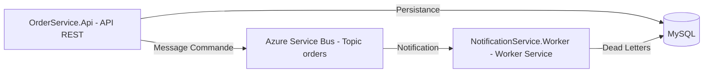

# Order Notification System

Système de notifications découplé via messaging en .NET utilisant Azure Service Bus **et MySQL pour la persistance**.

---

## 📦 Présentation

Ce projet propose une architecture microservices simple pour l’envoi de notifications lors de la création de commandes, **avec persistance des commandes et des messages Dead Letter en base de données MySQL**.

* **OrderService.Api** : API REST pour passer des commandes (stockées en MySQL)
* **NotificationService.Worker** : Service worker qui écoute les messages, traite les notifications **et archive en base MySQL les messages "dead letter"**
* **Azure Service Bus** : Message broker cloud (topic/subscription)
* **MySQL** : Stockage des commandes et des dead letters

---

## 🏗️ Architecture



---

## 🚀 Fonctionnalités

* Découplage complet API/Notifications via messaging cloud
* **Persistance des commandes ET des dead letters en base de données MySQL**
* Traitement asynchrone des commandes
* Gestion automatique des erreurs avec stockage des messages "dead letter" en BDD pour audit/retraitement
* Modèle extensible (ajout de nouveaux consommateurs facile)
* Prêt pour le déploiement cloud ou local (Docker, Azure App Service…)

---

## ⚙️ Installation & Lancement

### 1. Prérequis

* [.NET 8 SDK](https://dotnet.microsoft.com/download)
* Un compte Azure avec un Service Bus (niveau Standard)
* Un serveur MySQL local ou cloud
* Visual Studio 2022 ou VS Code

### 2. Cloner le repo

```bash
git clone https://github.com/votre-utilisateur/order-notification-system.git
cd order-notification-system
```

### 3. Configuration des secrets (User Secrets)

Toutes les informations sensibles (**connection string Azure Service Bus & MySQL**) sont gérées via [User Secrets .NET](https://learn.microsoft.com/fr-fr/aspnet/core/security/app-secrets?view=aspnetcore-8.0&tabs=windows) (aucune variable d’environnement n’est requise pour le développement local).

* **Connection string MySQL** :

  ```bash
  dotnet user-secrets set "ConnectionStrings:DefaultConnection" "server=localhost;port=3306;database=order_notification_db;user=root;password=motdepasse"
  ```
* **Connection string Azure Service Bus** :

  ```bash
  dotnet user-secrets set "ServiceBus:ConnectionString" "Endpoint=sb://...;SharedAccessKeyName=RootManageSharedAccessKey;SharedAccessKey=..."
  ```

*Exécutez ces commandes dans le dossier de chaque projet (`OrderService.Api` et `NotificationService.Worker`).*

### 4. Lancer les services

**Recommandé : démarrage multi-projets sous Visual Studio**

* Démarrer `NotificationService.Worker` (écouteur)
* Puis `OrderService.Api` (API REST)

---

## 📬 Tester l’API

* Accédez à Swagger : `https://localhost:7108/swagger`
* Endpoint POST `/api/orders` :

```json
{
  "customerName": "Alice Dupont",
  "amount": 123.45
}
```

* Sur envoi, vérifiez la console du worker : un message doit s’afficher avec la commande reçue
* Les commandes sont **persistées dans la base MySQL** (vérifiez via Workbench ou CLI)
* En cas d’erreur ou de message non consommable, le worker archive automatiquement le message dead letter en base MySQL (table `DeadLetters`)

---

## 🛡️ Sécurité

* Les secrets sont transmis uniquement via User Secrets (aucune donnée sensible versionnée)
* Prêt pour CI/CD sécurisé

---

## 🗄️ Dead Letter (Gestion des erreurs)

* Si un message n'est pas consommé correctement par le worker, il est automatiquement envoyé dans la **dead letter queue** d'Azure Service Bus.
* Le worker lit ces messages en dead letter et les enregistre en base de données MySQL (table `DeadLetters`).
* Cela permet l’audit, la supervision et le retraitement manuel ou automatisé des erreurs de messagerie.

---

## 🔗 Quelques pistes d'amélioration

* Notifications réelles (email, SMS, webhook…)
* Observabilité (logs, monitoring Azure)
* Déploiement cloud (Azure App Service, Docker Compose)
* **Dashboard/Front pour visualiser et rejouer les dead letters**
* Monitoring avancé et alertes

---

## 📝 Auteur

Florian – [portfolio-florian.fr](https://portfolio-florian.fr)
